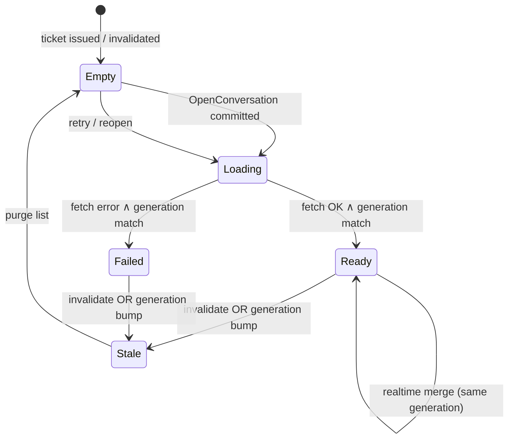

# Conversation Data Plane — design draft

**Stato:** `draft` (ingegneria interna, non promessa SDD)  
**Ultima revisione:** 2026-07-22  
**Contesti:** `navigation`, `messaging`, `multi-account`  
**Promessa correlata:** [PROM-CONVERSATION-SCOPE](../../specs/promises/product/PROM-CONVERSATION-SCOPE.md) (`approved`)

---

## 1. Problema verificato

Sintomo intermittente (nessun repro stabile): aprendo **test1 → Test 2**, la lista mostra messaggi della mailbox **test4 → Test 2** (es. `prova-out` presente solo lì in DB/RPC). Non è corruzione server; è **bleed di stato client** tra account con lo stesso peer.

`PROM-CONVERSATION-SCOPE` copre già commit/invalidate e generation guard su fetch, ma l'autorità della lista è **distribuita** (`MessagesController` + `MessagingConversationState` + effects + widget lifecycle). Le guardie esistenti non garantiscono un unico **ticket dati** coerente con ciò che la UI renderizza dopo switch rapidi o race init/dispose.

---

## 2. Obiettivo

Introdurre un **Conversation Data Plane (CDP)** — strato unico che possiede *cosa* la chat può mostrare — senza cambiare il confine prodotto finché non si dimostra il fix.

| Obiettivo | Descrizione |
|-----------|-------------|
| **Single authority** | Una sola fonte per `messages`, `loading`, `error` legati a un ticket |
| **Fail-closed render** | Lista vuota (o spinner) finché il ticket non è `Ready` e coincide con `committedScope` |
| **Generation everywhere** | Ogni fetch/realtime/merge incrementa o verifica `loadGeneration` |
| **Strangler** | CDP accanto al percorso attuale; parità via test prima del cutover |

**Non obiettivo (fase 1):** cache cross-session persistente, prefetch inbox, redesign RPC.

---

## 3. ConversationTicket

Estensione di `ConversationScope` con generazione di caricamento **per apertura conversazione** (distinta da `sessionEpoch` GoTrue).

```text
ConversationTicket = (
  ownerUserId,      // mailbox owner — da ConversationScope
  peerProfileId,    // peer — da ConversationScope
  sessionEpoch,     // restore/dispose sessione — da ConversationScope
  loadGeneration, // monotono per (owner, peer, sessionEpoch); bump su ogni invalidate/load
)
```

| Campo | Chi lo incrementa | Quando |
|-------|-------------------|--------|
| `sessionEpoch` | `AccountSession` | restore / dispose auth |
| `loadGeneration` | CDP | invalidate scope, nuovo `OpenConversation`, switch account, peer change |

**Regola render:** la UI legge messaggi **solo** se `ticket == navigation.committedScope + committedLoadGeneration`.

---

## 4. Stati CDP (per ticket)



| Stato | Lista UI | Fetch in flight |
|-------|----------|-----------------|
| `Empty` | `[]` | no |
| `Loading` | `[]` (mai lista precedente) | sì |
| `Ready` | snapshot CDP | opzionale background refresh |
| `Failed` | `[]` + errore | no |
| `Stale` | transitorio → `Empty` | risultati scartati |

**Vincolo critico:** transizione verso `Loading` **azzera sempre** la lista nel CDP (non nel controller legacy durante strangler).

---

## 5. Matrice invalidazione

Righe = eventi dominio; colonne = azione CDP. `gen++` = incrementa `loadGeneration` del ticket attivo (se esiste).

| Evento | `committedScope` (nav) | CDP `loadGeneration` | Lista CDP | Note |
|--------|------------------------|----------------------|-----------|------|
| `SwitchToAccount` | `null` | — | purge tutti i ticket non-owner | già `invalidateCommittedScope` |
| `OpenConversation` (stesso peer, stesso account) | commit nuovo scope | `gen++` | `Empty` → `Loading` | evita riuso lista |
| `OpenConversation` (altro peer) | commit | `gen++` | purge peer precedente | |
| `CloseConversation` | `null` | `gen++` | `Empty` | |
| `SessionRestored` / epoch change | invalidate se epoch mismatch | `gen++` | `Empty` | |
| Fetch completato (gen stale) | — | — | **no write** | scarta |
| Realtime event (gen stale) | — | — | **no merge** | scarta |
| `MessagesController.dispose` | — | — | ticket orfano → `Stale` | non propagare a UI |

Switch account con **stesso display name peer** (test1/test4 → Test 2): `ownerUserId` nel ticket è l'unico discriminante; la UI non deve mai riusare `MessagesController` il cui `scope.ownerUserId` ≠ sessione focalizzata.

---

## 6. Invarianti verificabili

| ID | Invariante | Verifica |
|----|------------|----------|
| **INV-CDP-1** | `∀ m ∈ renderedMessages : m.mailboxOwner == ticket.ownerUserId` | widget + unit |
| **INV-CDP-2** | `renderedMessages ≠ ∅` ⇒ `nav.isConversationReady ∧ ticket.loadGeneration == cdp.committedGeneration` | widget |
| **INV-CDP-3** | Dopo `SwitchToAccount`, finché non `Ready`, lista vuota | widget stress |
| **INV-CDP-4** | Nessun testo della mailbox X visibile sotto header account Y | regressione `prova-out` |
| **INV-CDP-5** | `isMine` calcolato con `ticket.ownerUserId`, non `auth.userId` volatile | unit bubble |
| **INV-CDP-6** | Fetch/realtime con `gen' < committedGen` non mutano stato | unit effects |

INV-CDP-4 istanzia il bug reale: **test4@test2** con `prova-out` → switch **test1** → open **Test 2** → assert **no** `prova-out`.

---

## 7. Architettura (strangler)

```text
NavigationMachine.committedScope  ──►  CDP.commit(ticket)
                                              │
                    ┌─────────────────────────┴─────────────────────────┐
                    ▼                                                   ▼
           ConversationDataStore                              MessagesController (legacy)
           (authoritative per render)                         (delega load/realtime a CDP)
                    │
                    ▼
           ChatPanel ← solo ReadonlySnapshot(ticket, messages, phase)
```

**Fase A — parallelo:** CDP riceve copia di ogni `fetchAndSetMessages` / realtime; `ChatPanel` continua a leggere controller; test confrontano CDP vs controller e falliscono su divergenza.

**Fase B — render:** `ChatPanel` legge solo CDP; controller diventa thin adapter verso macchine send/retry.

**Fase C — cleanup:** rimuovere `_state.messages` come autorità; tenere generation guard in un solo posto.

Posizione codice proposta: `client/lib/machines/messaging/conversation_data_plane.dart` + store per ticket; wiring in `home_screen.dart` / `AuthController`.

---

## 8. Test piano

| Suite | Scenario |
|-------|----------|
| **Widget regressione** | test4→Test2 (`prova-out`) → focus test1 → open Test2 → lista senza `prova-out` |
| **Widget stress** | 3 account, stesso peer, N switch rapidi, assert INV-CDP-1..3 |
| **Unit CDP** | matrice invalidazione, gen stale su fetch/realtime |
| **Estensione push contract** | riusa pattern `push_tap_message_contract_test.dart` con CDP assert |

Nessun repro manuale utente; gate CI esistente + nuovi test.

---

## 9. Modello e SDD (follow-up)

| Artefatto | Azione dopo approvazione design |
|-----------|----------------------------------|
| `docs/domain/messaging/commands-and-events.md` | evento `ConversationDataStale`; policy «lista vuota fino a Ready» |
| `docs/domain/multi-account/commands-and-events.md` | legame `FocusAccount` → purge CDP |
| `docs/model/uml/messaging/` | stato CDP nel diagramma messaging |
| `PROM-CONVERSATION-SCOPE` | amend **solo se** si formalizza promessa osservabile nuova (es. testo utente su lista vuota al switch); altrimenti resta copertura ingegneristica sotto PROM-005/006 |

---

## 10. Criteri di uscita draft

- [ ] Review utente su invarianti e matrice
- [ ] `approved` design → implementazione Fase A con conferma scrittura
- [ ] Test INV-CDP-4 verde prima del cutover render (Fase B)
